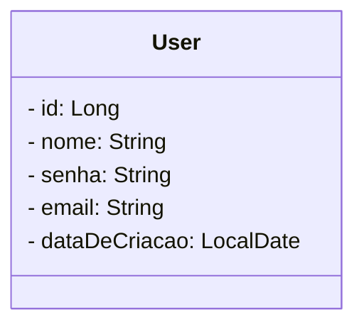

# Gerencia Users
Backend criado para cadastro e gerenciamento de usuários.


## Diagrama de Classes



## Tecnologias Utilizadas

- Java 17
- Spring Boot
- Spring Data JPA
- Lombok
- Postgres SQL (Prod)
- H2 (Dev)
- Imsomnia
- Spring Doc


## Organização das classes


## Requisições HTTP


## Documentação dos Endpoints


## Demonstração
Criação de um usuário
<br>


## Funcionalidades
- Criar um usuário
- Visualizar todos os usuários
- Visualizar usuário pelo seu ID
- Editar dados de um usuário
- Deletar um usuário pelo seu ID

## Estrutura do Projeto

O projeto tem a seguinte model principal:

- `User`: Representa um usuário na aplicação.


## Implementações Futuras
O Projeto está apenas com implementações simples de cada recursos que temos, logo será atualizado com mais métodos relacionados a usuário.
Além da adição de Spring Security, para que possamos ter autenticação e autorização para os usuários. também penso na impletação de email service,
para que possamos enviar um e-mail de confirmação para o usuário a cada requisição concluída com sucesso

## Como Usar

1. Clone o repositório:

   ```bash
   [git clone https://github.com/brielsene/dio-bank.git](https://github.com/brielsene/gerencia_user.git)

## Redes Sociais
- Linkedin
  <br>
https://www.linkedin.com/in/gabrielsenec


